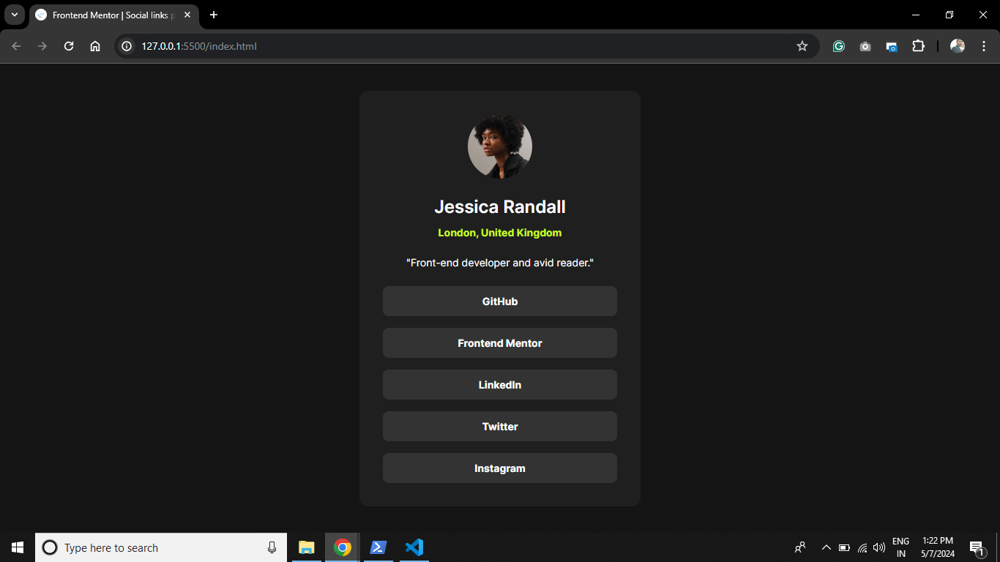

# Frontend Mentor - Social Links Profile Solution

This is a solution to the [Social Links Profile challenge on Frontend Mentor](https://www.frontendmentor.io/challenges/social-links-profile-UG32l9m6dQ). Frontend Mentor challenges provide opportunities to enhance coding skills by building practical projects.

## Table of Contents

- [Overview](#overview)
  - [The Challenge](#the-challenge)
  - [Screenshot](#screenshot)
  - [Links](#links)
- [My Process](#my-process)
  - [Built With](#built-with)
  - [What I Learned](#what-i-learned)
  - [Continued Development](#continued-development)
  - [Useful Resources](#useful-resources)
- [Author](#author)
- [Acknowledgments](#acknowledgments)

## Overview

### The Challenge

The primary goal of this challenge was to implement a responsive social links profile where users can interact with various elements, including hover and focus states.

### Screenshot



### Links

- Solution URL: [Solution URL](https://github.com/AvinashKumarMahato/Social-links-profile)
- Live Site URL: [Live site URL](https://avinashkumarmahato.github.io/Social-links-profile/)

## My Process

### Built With

- Semantic HTML5 markup
- CSS (including custom properties, Flexbox, and CSS Grid)

### What I Learned


Throughout this project, I gained valuable experience in HTML and CSS, which allowed me to deepen my understanding of responsive design principles, semantic HTML markup, and CSS layout techniques. I refined my ability to create interactive and visually appealing user interfaces, implement flexbox and CSS grid for layout, and optimize styles for various screen sizes. This experience enhanced my skills in building modern and accessible web applications while improving my proficiency in front-end development practices.

```html
<body>
    <article class="user-profile">
        <figure class="user-profile__figure">
            
        </figure>
        <h1 class="user-profile__name">Jessica Randall</h1>
        <p class="user-profile__location">London, United Kingdom</p>
        <h2 class="user-profile__bio">"Front-end developer and avid reader."</h2>

        <section class="user-profile__links">
            <a class="user-profile__link" href="https://github.com" target="_blank">GitHub</a>
            <a class="user-profile__link" href="https://frontendmentor.io" target="_blank">Frontend Mentor</a>
            <a class="user-profile__link" href="https://www.linkedin.com" target="_blank">LinkedIn</a>
            <a class="user-profile__link" href="https://twitter.com" target="_blank">Twitter</a>
            <a class="user-profile__link" href="https://www.instagram.com" target="_blank">Instagram</a>
        </section>
    </article>
</body>
```
### Continued development
Moving forward, I plan to focus on expanding my knowledge of JavaScript to enhance interactivity and functionality in my projects. I aim to delve deeper into frameworks like React.js and explore more advanced CSS techniques such as animations and transitions. Additionally, I am eager to learn about best practices in web accessibility and performance optimization to create even more efficient and inclusive websites.

### Useful Resources

During this project, I found the following resources particularly helpful:

- [CSS-Tricks](https://css-tricks.com/) - Comprehensive articles and guides on CSS techniques and best practices.
- [MDN Web Docs](https://developer.mozilla.org/en-US/) - In-depth documentation for HTML, CSS, and JavaScript, including tutorials and references.
- [Frontend Mentor Community](https://www.frontendmentor.io/community) - Engaging discussions and feedback from fellow developers on frontend challenges.

Feel free to explore these resources to deepen your understanding of web development concepts and refine your skills.

### Author

Hi, I'm Avinash Kumar Mahato! I'm passionate about frontend development and enjoy crafting engaging user experiences through clean and efficient code. You can find more of my work on [my portfolio](https://www.your-portfolio.com) and connect with me on [LinkedIn](https://www.twitter.com/yourusername).

### Acknowledgements

I would like to express my gratitude to Frontend Mentor for their support and inspiration during this project. Their insights and feedback were invaluable in shaping the outcome and fostering a collaborative learning environment.

